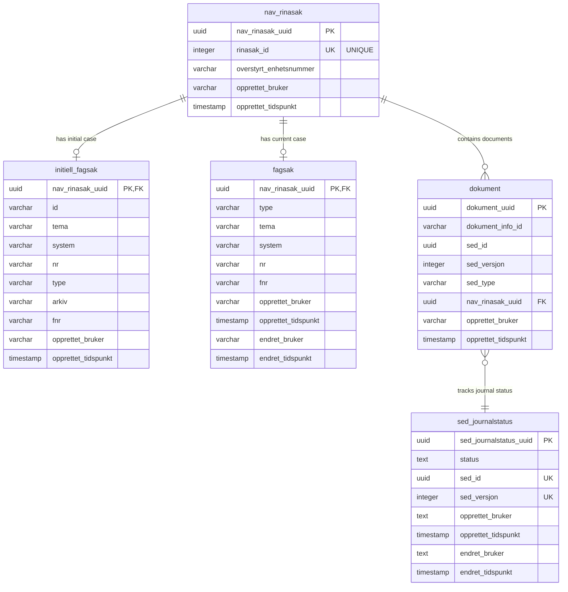

# EUX Nav Rinasak

A service for linking NAV and RINA cases (Sammenknytning av nav og Rina-saker).

## Technologies
* Kotlin
* Spring Boot
* Maven
* PostgreSQL
* Flyway (Database migrations)

## Prerequisites

* JDK 21
* PostgreSQL database

## Local Development

### Database Setup

For running database tests locally, ensure PostgreSQL is running and set the following environment variables:

```bash
export DATABASE_HOST=localhost
export DATABASE_USERNAME=postgres
export DATABASE_DATABASE=postgres
export DATABASE_PORT=5432
```

### Running Tests

```bash
mvn test
```

### Building the Application

```bash
mvn clean install
```

## Project Structure

This is a multi-module Maven project with the following modules:

- **eux-nav-rinasak-model** - Domain models and DTOs
- **eux-nav-rinasak-persistence** - Database entities and repositories
- **eux-nav-rinasak-service** - Business logic and services
- **eux-nav-rinasak-openapi** - OpenAPI specification and generated code
- **eux-nav-rinasak-webapp** - REST API and web application

## Database Schema



### Database Relationships

- **nav_rinasak** is the central entity representing a RINA case in NAV
- **initiell_fagsak** stores the initial case information (one-to-one with nav_rinasak)
- **fagsak** stores the current/updated case information (one-to-one with nav_rinasak)
- **dokument** stores documents associated with a RINA case (one-to-many with nav_rinasak)
- **sed_journalstatus** tracks the journal status of SED documents (related to dokument via sed_id and sed_versjon)
